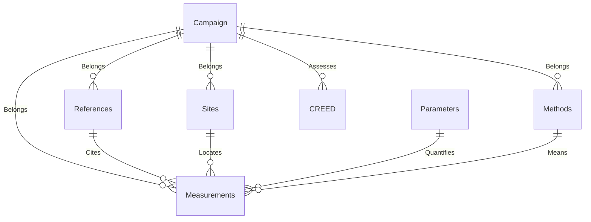

# eData Data Reporting Format

The eData Data Reporting Format is a format for the standardisation of data on pollutant occurence in the environment. By converting this data to a single, consistent format, it makes it easier to validate, compare, analyse, and reuse, in line with the [FAIR principles](https://www.go-fair.org/fair-principles/).

These data are typically published as concentrations (in water) or mass ratios (in soil, sludge and biota). Fully interpreting these measurements requires considerable metadata, relating to the time, place, conditions, methodology, and context of sampling. However, no single standard exists for these metadata, and study authors and sampling teams tend to use a variety of inconsistent definitions, units, and schema depending on their scientific domain and the study's individual needs. 

This is not, in itself a problem. However, as environmental risk assessment becomes more data-based and larger scale, the need to use and re-use large quantities of data increases. When these datasets are consistent, validated, and interoperable, much time can be saved. When they are not, researchers much go through the tedious process of understanding, validating and remapping by hand; an often non-reproducible process. Thus a harmonised format - and associated validation and formatting functions - can represent a significant timesaver for anyone in such as position. 

This format is a (first) attempt to address this issue. Rather than attempt a perfect format that covers all relevant domains, we have elected to focus on pollutants in water, aquatic biota, and similar compartments (sludge, aquatic sediment, etc.). This has been designed to follow a database-like structure, with the expectation that the format will be developed into a full database schema in the future. 

# Usage

To install the format, you will need the `{devtools}` package:

```r
install.packages("devtools")
devtools::install_github("NIVANorge/eDataDRF")
```

Once installed, tables can be created using the relevant functions:

```r
campaign_table <- initialise_campaign_table()
biota_table <- initialise_biota_table()
```

Likewise, controlled vocabulary is available as functions that return vectors, lists, or tables. In some cases, helper functions are available that wrap multiple invididual functions.

Where external data sources are used to generate a vocabulary, functions may wrap (processed) data from other R packages or load raw data from external sources.

```r
measured_categories_vocabulary() # returns a named vector

environ_compartments_sub_vocabulary() # returns a nested list

extraction_protocols_vocabulary() # returns a tibble

protocol_options_vocabulary() # calls bind_rows() on four *_protocol_vocabulary() functions to return a tibble

coordinate_systems_vocabulary() # calls crsuggest::crs_sf, returns 4 rows 

# TODO: Make name less stupid.
areas_vocabulary() # loads an RDS of IHO ocean definitions from /extdata/

```

## Tables

Tables are created as `tibble::tibble()` calls with empty variables of specific types (e.g. `character(0)` for strings). These support easier validation (see [Validation](https://NIVANorge.github.io/eDataDRF/articles/validation.html)) and the extensive Tidyverse family of functions.

Tables are listed below:

| Table Name | Purpose | Comments |
|---|---|---|
| [Campaign](https://NIVANorge.github.io/eDataDRF/articles/campaign_data.html) | Records data about sampling campaign and organisation collecting data. | |
| [Reference](https://NIVANorge.github.io/eDataDRF/articles/references_data.html) | Records conventional publication metadata, where available | |
| [Sites](https://NIVANorge.github.io/eDataDRF/articles/sites_data.html) | Records site coordinates, land use, country/ocean | |
| [Parameters](https://NIVANorge.github.io/eDataDRF/articles/parameters_data.html) | Records data on stressors (chemical, radiation, etc.), quality measurements | |
| [Compartments](https://NIVANorge.github.io/eDataDRF/articles/compartments_data.html) | Records information on the compartment/matrix sampled | |
| [Samples](https://NIVANorge.github.io/eDataDRF/articles/samples_data.html) | Records which combinations of dates, sites, parameters and compartments were sampled | Not used in final analysis, but exists as an intermediate table used to create measurements |
| [Biota](https://NIVANorge.github.io/eDataDRF/articles/biota_data.html) | Where relevant, records biota species, tissue, life stage, and gender | Optional |
| [Methods](https://NIVANorge.github.io/eDataDRF/articles/methods_data.html) | Records type and descriptions of methods used for sampling, extraction, fractionation and analysis | |
| [Measurements](https://NIVANorge.github.io/eDataDRF/articles/measurements_data.html) | Records measured values, units, uncertainty, sample size, and methods associated with a given sample | |
| [CREED (quality)](https://NIVANorge.github.io/eDataDRF/articles/CREED_data.html) | Records assessment purpose statement, relevant data summarised from above tables, relevance/reliability scores, and final assessment of data quality. | |
| [CREED Scores](https://NIVANorge.github.io/eDataDRF/articles/CREED_scores_data.html) | [description needed] | |




- Caveats
- Links
- Vignettes