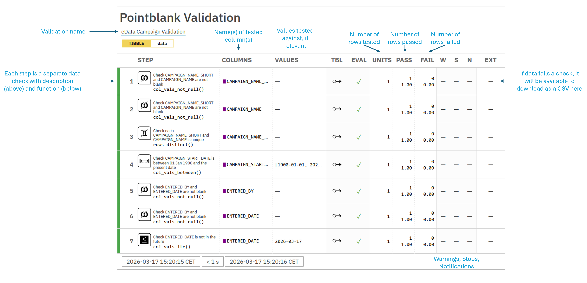

```{r setup}
library(eDataDRF)
library(pointblank)
library(gt)

```

The `{pointblank}` package for R provides robust, efficient validation features for data, allowing us to quickly check that our data conforms to the expected format. Although used of controlled vocabulary and the eData app allow us to constrain user-entered data, it is more practical to add an additional level of validation. This programmatic validation layer can be re-used wherever needed; this is particularly valuable when data may need to be transformed as part of the analysis pathway. For a thorough overview of pointblank functionality, please consult the package's documentation.

# Campaign data validation

```{r}
#| label: campaign-validation

# generate example data
example_campaign_tibble() |>
  # assign validation rules to each column
  pb_validate_campaign() |> 
  # run validation rules and generate a summary table
  interrogate() |> 
  # display the table in a report or live session
  get_agent_report()
```

For information on how to interpret this output, please see the image below:



# References data validation

```{r}
#| label: references-validation
example_references_tibble() |>
  pb_validate_reference() |> 
    interrogate() |> 
  get_agent_report()

```

# Sites data validation

```{r}
#| label: sites-validation

example_sites_tibble() |>
  pb_validate_sites() |> 
    interrogate() |> 
  get_agent_report()
```

# Parameters data validation

```{r}
#| label: parameters-validation
example_parameters_tibble() |>
  pb_validate_parameters() |> 
      interrogate() |> 
  get_agent_report()
```

# Samples data validation

```{r}
#| label: samples-validation
example_samples_tibble() |>
  pb_validate_samples() |> 
      interrogate() |> 
  get_agent_report()
```

# Biota data validation

```{r}
#| label: biota-validation
example_biota_tibble() |>
  pb_validate_biota() |> 
      interrogate() |> 
  get_agent_report()
```

# Methods data validation

```{r}
#| label: methods-validation
example_methods_tibble() |>
  pb_validate_methods() |> 
      interrogate() |> 
  get_agent_report()
```

# Measurements data validation

```{r}
#| label: measurements-validation
example_measurements_tibble() |>
  pb_validate_measurements() |>
  interrogate() |>
  get_agent_report()
```

# CREED data validation

CREED data is validated separately as Relevance and Reliability.

```{r}
#| label: creed-validation-rv
example_CREED_relevance_tibble() |>
  pb_validate_CREED_data_relevance() |> 
    interrogate() |> 
  get_agent_report()
```

```{r}
#| label: creed-validation-rb
example_CREED_reliability_tibble() |>
  pb_validate_CREED_data_reliability() |> 
    interrogate() |> 
  get_agent_report()
```

# CREED scores data validation

```{r}
#| label: creed-scores-validation
example_CREED_scores_tibble() |>
  pb_validate_CREED_scores() |> 
    interrogate() |> 
  get_agent_report()
```